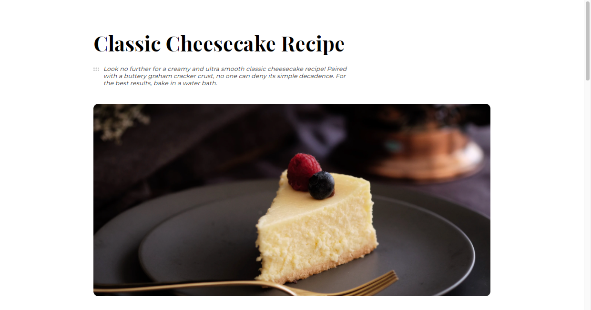

<!-- Please update value in the {}  -->

<h1 align="center">Recipe page</h1>

   Solution for a challenge from  <a href="http://devchallenges.io" target="_blank">Devchallenges.io</a>.

  <h3>
    <a href="https://recipe-page-fatimagr.vercel.app">
      Demo
    </a>
     | 
    <a href="https://github.com/FatimaGR/Recipe-page-solution">
      Solution
    </a>
     | 
    <a href="https://devchallenges.io/challenges/OEKdUZ6xs0h99C38XVht#">
      Challenge
    </a>
  </h3>

<!-- OVERVIEW -->

## Overview

### The challenge

Create a recipe page following the given design. You can use your own recipe and remember to put the source. The page should be responsive. Fulfill user stories below:

- [✓] User story: I can see a recipe with ingredients and instructions
- [✓] User story: I can select a checkbox if I have the ingredients
- [✓] User story: I can see the number of servings, baking times

### Built With

- HTML
- CSS

<!-- THE CHALLENGE -->
## Contact

- Website - [Fatima Gallardo](https://porfolio-website-gules.vercel.app)
- GitHub - [@FatimaGR](https://github.com/FatimaGR)
- Dev challenges - [@FatimaGR](https://devchallenges.io/portfolio/FatimaGR)
